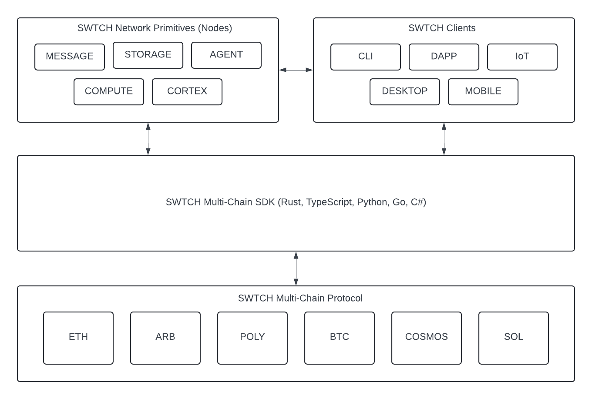

# Architecture

## Platform Architecture
The SWTCH Platform is organized across multiple logical contexts.

### Core Contexts

- File Format 
- Encryption Standards
- Multi-Chain Extensibility
- Multi-Chain Protocol
- Multi-Chain SDKs
- Verifiable Proof of Service
- Decentralized Network Infrastructure Components

## Platform Architecture Diagram
The SWTCH Platform Diagram 

## File Format
A new file structure and packaging format has been created to suit our decentralized network for file storage and sharing.

#### SWTCH File Format
A standard SWTCH file structure is composed of the following key properties:

- version: The version of the file format.
- ownership: Stores the owner(s) of the file as hexadecimal hashes generated using Secp256k1.
- data: Splits the data into smaller chunks for easier distribution across the network.
- signature: Contains a digital signature of the file contents for verifying authenticity.
- nonce: A unique value to prevent replay attacks, ensuring each file instance is unique.
- metadata: An optional field for storing additional metadata about the file.
- access_control: Lists the public keys of users who have access to the file.
- hash: A cryptographic hash of the file's contents for data integrity checks.
permissions: An optional field specifying permissions associated with the file (e.g., read, write, share).
- encryption_info: An optional field detailing the encryption method used for the file.
- vec: Stores the vector representation of the file's data for search capabilities in a vector database.
- vec_info: Describes how the vector embeddings were created (e.g., method like word2vec, tokenizer used).
- merkle_root: The root hash of the Merkle tree, used for verifying the integrity of the data chunks.
- modified: Records the timestamp of when the file was last modified.

## Encryption Standards
SWTCH networks utilize end-to-end (E2E) encryption and secure all data at rest.

The SWTCH Platform employs two primary encryption methods:

- ECIES: This method leverages the efficiency and compact key sizes of Elliptic Curve Cryptography (ECC). ECIES is popular in modern applications such as blockchain technology, secure messaging, and IoT devices. It combines ECC with symmetric encryption mechanisms to enhance security while maintaining performance.

- Quantum Resistant: This method uses hybrid cryptography, combining post-quantum cryptographic algorithms with traditional public key algorithms (such as RSA or elliptic curves). Our hybrid approach ensures the encryption is resistant to both classical and potential future quantum computer attacks, providing a security level at least equivalent to existing traditional cryptographic methods.

#### ECIES Keypair
Keypair generation involves the use of ECIES (Elliptic Curve Integrated Encryption Scheme).

- Algorithm Basis: ECIES is based on elliptic curve cryptography (ECC), which leverages the mathematics of elliptic curves over finite fields. It integrates public-key cryptography for secure encryption.
- Key Generation: In ECIES and ECC, key generation involves selecting a point on an elliptic curve and choosing a private key, which is a random number. The public key is derived by multiplying this private key by a generator point on the curve. The difficulty of ECC is ensured by the elliptic curve discrete logarithm problem (ECDLP).
- Key Sizes: Elliptic curve keys can be much smaller than RSA keys while providing comparable security. For example, a 256-bit ECC key is considered roughly equivalent in security to a 3072-bit RSA key.
- Performance: ECC offers better performance and lower resource consumption than RSA, making it suitable for environments with limited computational power, storage, or bandwidth. This is one reason why ECC, and by extension ECIES, is favored for mobile devices and IoT applications.

#### Quantum KEM Keypair
Quantum KEM keypair generation offers a suite of available quantum encryption algorithms:

- BikeL1
- BikeL3
- BikeL5
- Kyber512
- Kyber768
- Kyber1024
- NtruPrimeSntrup761
- FrodoKem1344Aes
- FrodoKem1344Shake
- ClassicMcEliece348864
- ClassicMcEliece348864f
- ClassicMcEliece460896
- ClassicMcEliece460896f
- ClassicMcEliece6688128
- ClassicMcEliece6688128f
- ClassicMcEliece6960119
- ClassicMcEliece6960119f
- ClassicMcEliece8192128
- ClassicMcEliece8192128f

#### Quantum Cipher Suites
SWTCH uses AES (Advanced Encryption Standard), ChaCha20, and XChaCha20 cryptographic cipher suites to secure data. Each has unique characteristics and use cases. Here's a brief overview:

###### AES (Advanced Encryption Standard):
- Type: Symmetric key cipher
- Key Sizes: 128, 192, or 256 bits
- Block Size: 128 bits
- Usage: AES is widely used in security protocols such as SSL/TLS for securing websites, Wi-Fi encryption (WPA2 and WPA3), and more. AES has been extensively analyzed and is regarded as secure against all attacks except for brute force, which is mitigated by using larger key sizes.

###### ChaCha20:
- Type: Stream cipher
- Key Size: 256 bits
- Nonce Size: 64 bits traditionally (32 bits used in practice for protocols like TLS)
- Usage: ChaCha20 is known for its high speed and strong security profile, especially in software implementations where AES-NI (hardware acceleration for AES) is not available. It is used in applications like TLS encryption (from version 1.3 onwards) and for securing VPNs (e.g., Google's use in Chrome's HTTPS connections). Designed by Daniel J. Bernstein, it is favored for its efficiency and security.

###### XChaCha20:
- Type: Stream cipher
- Key Size: 256 bits
- Nonce Size: 192 bits
- Usage: XChaCha20 extends ChaCha20 to support a larger nonce size, beneficial for applications requiring non-repeating nonces over a greater number of messages without frequent re-keying. This makes it suitable for high-volume applications or situations where unique nonces cannot be practically guaranteed. XChaCha20 is used in various cryptographic libraries and applications focused on privacy and security.

## Multi-Chain Extensibility
The purpose of the Multi-Chain Protocol and SDKs is to spur adoption of the protocol across many teams of developers, enabling seamless interaction with the SWTCH Protocol on various blockchain networks.

## Multi-Chain Protocol
The SWTCH Protocol is a comprehensive set of smart contracts designed to provide decentralized services and interactions. It is deployed on multiple EVM blockchains and will also be extended to other networks such as Cosmos and Solana.

###### Contexts of the SWTCH Protocol
- Protocol: A decentralized autonomous organization (DAO) that will eventually take on administrative roles, enabling community-driven governance and management of the protocol.
- Identity: Incorporates ERC-725 and ERC-735 standards along with identity solutions like Civic and Polygon ID to provide a robust identity framework for secure and verifiable interactions.
- Network: Focuses on the registration and management of network services, including messaging, storage, computation, and agent services. This context aims to provide a comprehensive infrastructure for decentralized applications.
- Secrets: Decentralized secrets management to support network services, ensuring secure handling of sensitive information.
- Payments: Facilitates the creation and management of payment channels, proof of funds, escrow services, and subscriptions, enabling seamless financial interactions within the network.
- Token: Manages the creation and administration of various token standards (ERC-20, ERC-721, ERC-1155, ERC-404, ERC++), integrating them with identity for network services and information, enhancing utility and interoperability.

## Multi-Chain SDKs
The SWTCH SDKs are written in Rust, Python, TypeScript, and Go to allow users on these respective platforms to interact with the protocol without having any knowledge of blockchain. These SDKs enable developers to integrate the SWTCH Protocol into their applications seamlessly.

#### Multi-Chain SDKs Key Points
- Wallet Support: Provides support for wallet operations, enabling users to manage their identities and assets.
- Smart Contract Interaction: The SDK can load a smart contract into context to execute transactions, making it easy for developers to interact with the protocol's smart contracts.
- Multi-Language Support: Multi-Chain SDKs are deployed to multiple language targets (Rust, Python, TypeScript, and Go), ensuring broad accessibility and ease of integration for developers across different programming environments.

## Verifiable Proof of Service (VPoS)
At SWTCH, we are proposing a new proof system to manage the state of services in payment channels, termed "Verifiable Proof of Service" (VPoS). VPoS enables decentralized service indexing and verification.

#### Benefits of VPoS
- Settlement Layer for Decentralized Services: Provides a secure and transparent mechanism for settling payments for decentralized services.
- Service Provision Verification: Allows for proving the provision of services within a decentralized infrastructure.
- Decentralized Service Index: Maintains a public index of decentralized services, enhancing discoverability and trust.

Verifiable services align with the broader trend of verifiable credentials and self-sovereign identity systems.

#### Proposed Proof System
Verifiable proof is established by registering an existing service with an identity or wallet.

###### Verifiable Service Components
- On-Chain Smart Contract Protocol: Manages service registration, verification, and transactions.
- API SDK Workload Execution: Facilitates integration of the service with the SWTCH protocol.
- Off-Chain Submit Workload: Handles the submission and logging of workloads.
- Service Reputation Ratio: Computed as the ratio of completed workloads to total workloads.

#### Use Case Actors
There are two primary actors within this proof system:

1. User of the Verifiable Service: Utilizes the services provided by the operator.
2. Verifiable Service Operator: Provides and maintains the services.

###### Verifiable Service Operator Responsibilities
- Create an API Service: Develop the service to be provided.
- Register API Service, Methods, and Pricing: Use the SWTCH Protocol to register the service on their preferred network.
- Integrate the SWTCH SDK: Embed the SDK into the API service endpoints.
- Accept Verified Encrypted Payloads: Process payloads from users at the API service endpoints.
- Workload Log Commitment: Write each payload to disk as a Workload Log Commitment.
Commit Proofs to SWTCH Protocol: Use the SWTCH SDK to submit proofs to the Service Payment Channel.
- Fee and Reward Processing: The SWTCH Protocol verifies the authenticity of commitments and transfers the earned fees and rewards to the operator in SWTCH tokens.

###### Decentralized Service Registration
- Decentralized Registration: Services (e.g., messaging, storage, compute, AI agent services) can be registered without relying on a central authority.
- Service Indexing and Verification: Indexing allows efficient discovery and access, while verification ensures validity and trustworthiness.
- Decentralized Settlement Layer: Handles transactions related to service access, facilitating payments, resource allocation, and other settlement processes.

## Overall Implications
Verifiable Proof of Service is a comprehensive solution for managing decentralized services. By combining registration, verification, settlement, and developer tools, VPoS aims to enhance the overall ecosystem, providing transparency, security, and efficiency.

## Decentralized Network Infrastructure Components
SWTCH will provide the initial infrastructure projects by integrating the SDK into each node. This integration will ensure that each node is equipped to run the services for the SWTCH Platform.

#### SWTCH Infrastructure Nodes
###### Messaging Node 
- Provides encrypted messaging services for a given network.
- Ensures secure and private communication.

###### Storage Node
- Offers encrypted storage for file data and vector data.
- Facilitates secure and reliable data storage.

###### Compute Node
- Delivers computation services with input and output capabilities.
- Supports a variety of computational tasks within the network.

###### AI Agent Node
- Configurable context with input and output capabilities.
- Facilitates Retrieval-Augmented Generation (RAG) and orchestrates a mixture of agents with domain expertise.

###### RAG Node
- Manages a configurable set of AI Agent Nodes.
- Orchestrates the operation of multiple AI agents to handle complex tasks.
- Uses an orchestration tool to efficiently manage and coordinate the AI Agent Nodes.

#### SDK Integration
The SDK-integrated services have built-in capabilities to:

- Register their API with the SWTCH Protocol.
- Start the services seamlessly.
- Ensure all interactions and operations are secure and verifiable.
